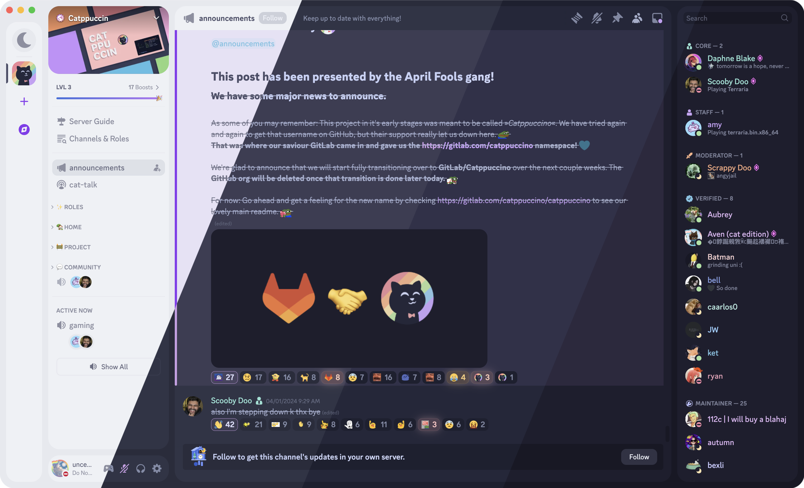
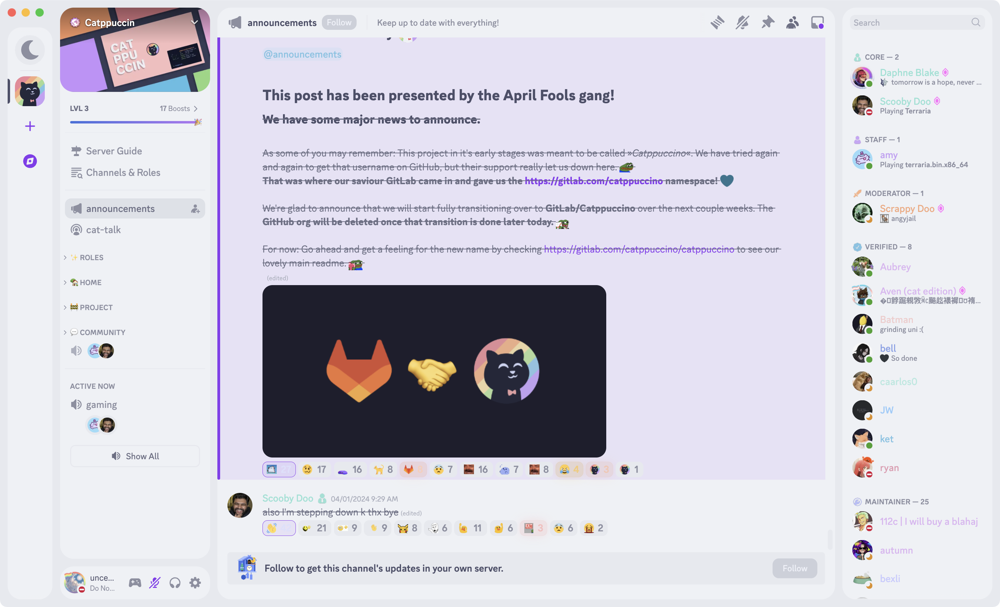
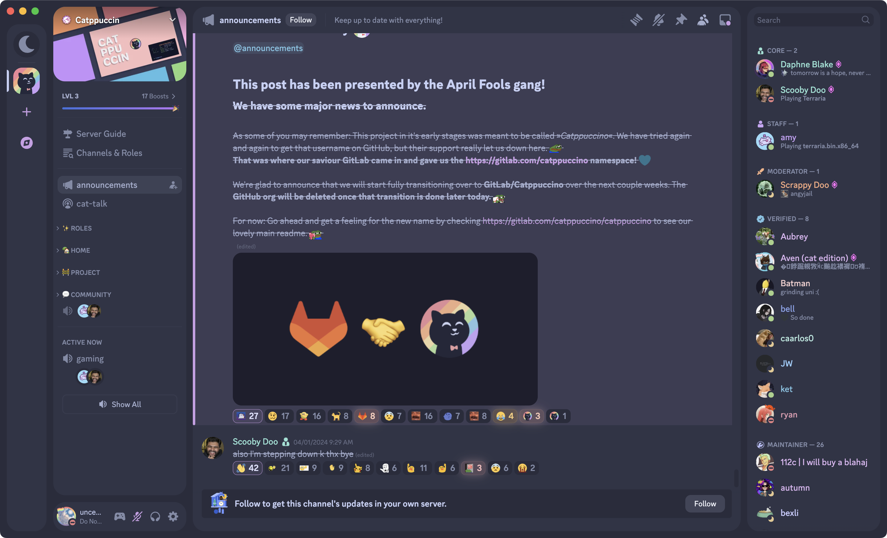
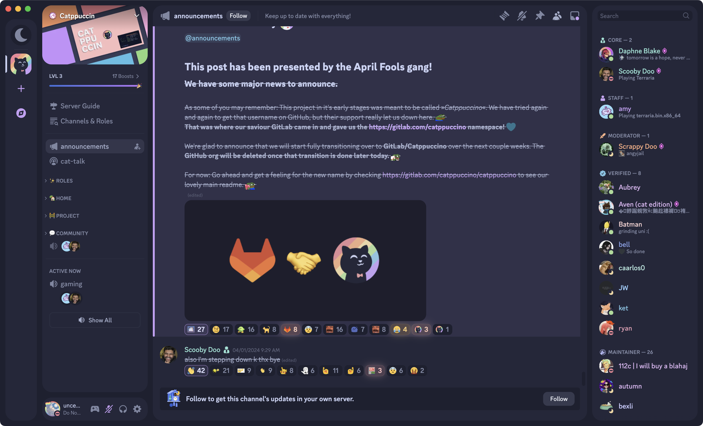
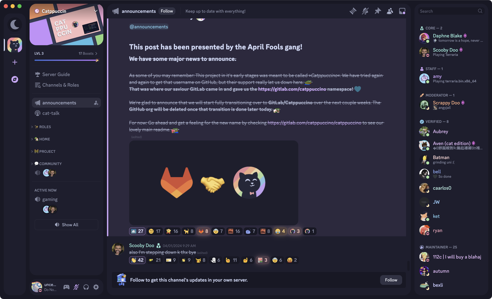

<h3 align="center">
	 
	
	Catppuccin for <a href="https://github.com/refact0r/midnight-discord">midnight</a>
	
</h3>

	
	
	

	

## Previews

🌻 Latte

🪴 Frappé

🌺 Macchiato

🌿 Mocha

## Usage

1. Add `https://raw.githubusercontent.com/uncenter/ctp-midnight/main/themes/<flavor>-<accent>.css` (replacing `<flavor>` and `<accent>` with your favorite flavor and accent, respectively) to your online themes.

## 💝 Thanks to

- [uncenter](https://github.com/uncenter)

&nbsp;

	

	Copyright &copy; 2021-present <a href="https://github.com/catppuccin" target="_blank">Catppuccin Org</a>

	

